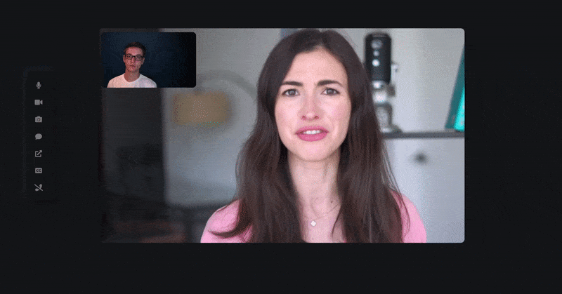

# AUAVideoCalls - Decentralized Video Chat

[](https://www.linkedin.com/in/cohnen)

[](https://github.com/prettier/prettier)

# https://auavideo.herokuapp.com

Decentralized video chat platform powered by WebRTC using Twilio STUN/TURN infrastructure.
AUAVideoCalls provides video quality and latency simply not available with traditional
technology.


## Features



- Screen sharing
- Picture in picture
- Live captions
- Text chat
- Auto-scaling video quality
- No download required, entirely browser based
- Direct peer to peer connection ensures lowest latency
- Single use disposable chat rooms

## Quick start

- You will need to have Node.js installed, this project has been tested with Node version 10.X and 12.X
- Clone this repo

#### Set up credentials

- Rename .env.template to .env
- Sign up for free twilio account https://www.twilio.com/login
- Get your Account SID and Auth Token from the Twillio console
- Fill in your credentials in the .env file

#### Install dependencies

```
npm install
```

#### Start the server

```
npm start
```

- Open `localhost:3000` in browser
- If you want to use a client on another computer/network, make sure you publish your server on an HTTPS connection.
  You can use a service like [ngrok](https://ngrok.com/) for that.

## Contributing

Pull Requests are welcome!

Please run prettier on all of your PRs before submitting, this can be done with `prettier --write` in the project directory
